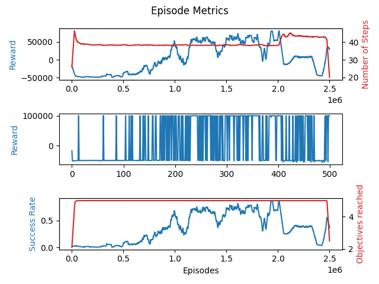
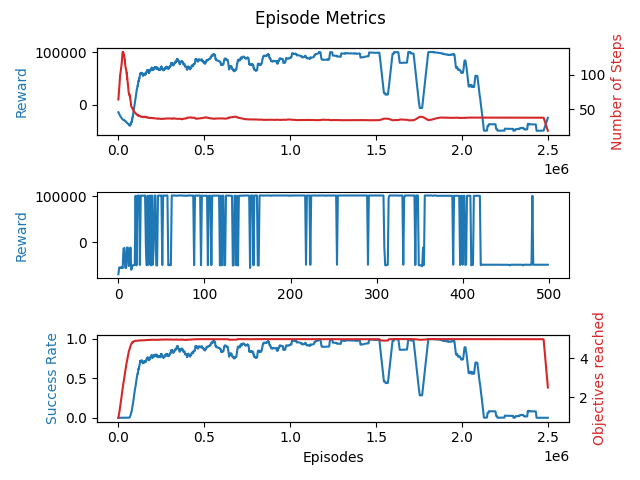
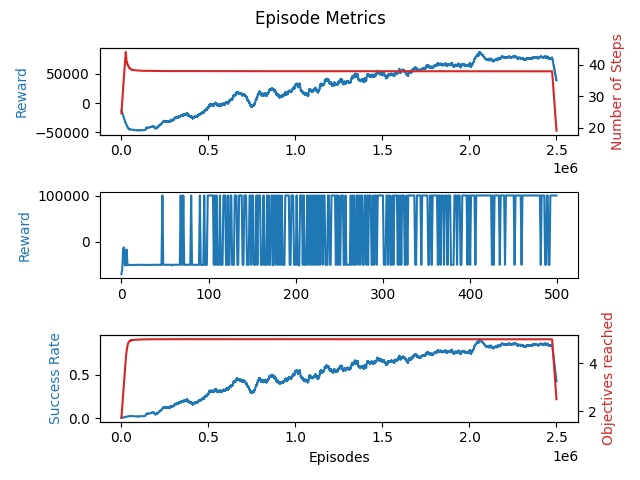
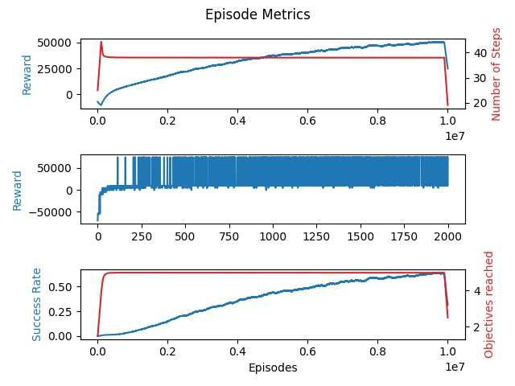
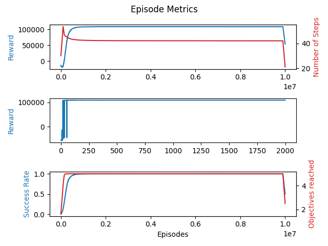
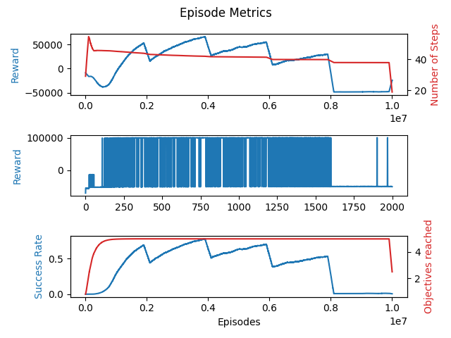

# GridWorldQ-Learning

The project aims to implement the tabular Q-Learning method for an agent whose goal is to explore a grid world to visit a predetermined number of fixed stations while avoiding depleting its available battery.

## Setting

### Agent

The agent has a limited amount of battery (rechargeable) calculated automatically in relation to the environment size to allow enough exploration freedom, after which the episode is declared failed unless the primary objective has been completed.
The agent uses a tabular Q-Learning algorithm to learn the optimal policy. The policy used to navigate the environment is an epsilon greedy policy with an exploration factor that decreases hyperbolically. During the test phase, the epsilon value is set to zero to be able to select the best actions at each step according to what is stored in the table.

The table update is done according to the [**Prioritized Experience Replay**](https://arxiv.org/abs/1511.05952) technique.

Each row of the table is associated with a state consisting of:

- Remaining battery for the agent (integer)
- Current position (array with the position)
- Visited targets (binary array)

The available actions for the agent are:

- Move up
- Move down
- Move right
- Move left

### Environment

The environment consists of a square grid of variable size, decidable by the user, within which a variable number of positions are identified that the agent must visit before returning to the starting cell.
The starting position serves as a charging station where the agent can restore its battery.

### Reward Function

The reward function used for training penalizes:

- each step to encourage the search for the shortest path
- if the agent remains stationary (because it hits the grid boundary)
- if the agent runs out of battery without completing the task or if it exceeds the maximum number of steps allowed for each episode

it rewards, instead, for:

- each target position visited
- getting closer to the base after visiting all targets (necessary to favor task completion)
- task completion (all targets visited and returned to base)

### Training Artifacts

At the end of each training session, the following are produced:

- videos of some training episodes
- videos of all test episodes
- the Q-Table that provides the consistently best policy
- the final Q-Table
- three graphs showing the progress of the reward obtained and the steps used in each episode, the reward provided by the optimal policy (calculated at intervals), the success rate and the number of targets reached in each episode.

## Architecture

The code is organized into 5 main files:

### Agent.py

Represents the agent, contains the Q-Table, the Replay Buffer, all parameters (learning rate, epsilon, discount factor, etc...) and all necessary methods for their update. In particular:

- a method that implements the epsilon greedy policy
- a method for calculating the temporal difference
- two variants of a method for updating values within the table, one that implements the classic form of Tabular Q-Learning

    $$ Q_t (x(t), u(t)) = Q_{t-1}(x(t), u(t)) + \beta \cdot \left[ r(t) + \alpha \max_{u'} Q_{t-1} ( x(t +1), u') - Q_{t-1}(x(t), u(t)) \right] $$

    the second that implements the **Prioritized Experience Replay** method applied to a tabular context:

    $$ Q_t (x(t), u(t)) = Q_{t-1}(x(t), u(t)) + \beta \cdot w \cdot \left[ r(t) + \alpha \max_{u'} Q_{t-1} ( x(t +1), u') - Q_{t-1}(x(t), u(t)) \right] $$

- a method that applies scheduled decay to parameters during training
- a method to save the agent's Q-Table to file
- a method to load a Q-Table from file for the agent

### PrioritizedBuffer.py

Represents the Replay Buffer, a limited-size buffer with associated priorities, necessary for implementing the PER method.
The buffer is characterized by a series of parameters (by default the same as the paper, customizable by the user) important for the correct management of priorities and weights.
The provided methods allow:

- adding new "experiences" with the correct priority
- sampling a batch of experiences with their weights
- updating the priorities of present experiences
- updating the $\beta$ parameter

### Environment.py

This file contains the environment class that derives from the Env class of the *Gymnasium* library (a standardized framework that allows developing simulation environments for Reinforcement Learning) and an Enum class that encodes the possible actions that an agent can perform.

The Environment class contains all the characteristics of the environment in which the agent moves, sets the initial state and charge of the agent (calculated automatically to make it possible to visit the perimeter of the environment) and must necessarily implement the following methods:

- `reset()` to reset the initial state after each episode, repositions the agent and restores its charge as well as resetting all targets as not visited
- `step()` to execute a step during an episode, chooses an action and calculates all its practical consequences (such as movement). The reward function is also coded in this method.
- `get_observation()` and `get_info()` to obtain the state and other useful information during training.

There is also a series of methods useful for recording episodes to be able to view them later.

### Train.py

This file contains all the necessary functions for training and testing.
In the training loop, for each episode:

- choose an action
- execute a step and observe the consequences
- add the observation to the experience buffer
- sample a certain number of examples from the buffer and for each calculate the temporal difference to update the table
- update the priorities of the elements in the table

after each episode, proceed with the decay of agent and buffer parameters and save the collected data to be able to visualize it later.

Cyclically, after a number of episodes defined by the user, it verifies which is at that moment of training the best policy according to the table. The Q-Table that generates this policy is saved in case its average success rate is the highest ever recorded. This is useful because with PER the table tends to regress once maximum performance is reached.

In the test loop, the exploration factor is zeroed and a much smaller number of episodes is analyzed where only the best policy extracted from the Q-Table is used. At the end of the loop, the results are synthesized in terms of average reward, average steps, average targets visited and average success rate.

### main.py

The script with (almost) all modifiable parameters that instantiates everything necessary and starts the training and test loops.

## Execution and Parameters

The project was executed with Python 3.12.8, the packages present in the `requirements.txt` file are required.

The modifiable parameters are:

### Training and Test Parameters

- n_episodes: number of training episodes
- learning_rate: starting learning rate
- final_lr: minimum possible learning rate after decay
- discount: discount factor
- start_epsilon: starting exploration factor
- final_epsilon: minimum possible exploration factor after decay
- epsilon_decay_factor: decay factor for the exploration factor, smaller numbers lead to slower decay
- lr_decay_factor: decay factor for the learning rate, smaller numbers lead to slower decay
- period: number of episodes after which the currently stored best policy is cyclically tested
- memory_batch: number of Memory Buffer episodes that are re-evaluated at each training step
- load_and_test: allows loading an already saved table and skipping the training phase if set to `True`
- show_results: if `True` shows summary graphs at the end of training
- n_test_episodes: number of episodes on which to test the policy

### Prioritized Memory Buffer Parameters

- buffer_size: number of steps that can be stored in the buffer
- alpha: parameter that decides the probability of sampling one Memory Buffer event rather than another; alpha equal to zero corresponds to the uniform case (classic Experience Replay)
- beta: starting value of the bias correction parameter introduced by sampling, grows during training until reaching 1 (complete compensation)

### Environment Parameters

- grid_size: grid size
- target_positions: position of the targets that the agent must reach
- max_episode_steps: maximum number of steps allowed in an episode before considering it terminated

## Results and Examples

With this setting, it was possible to obtain stable policies capable of solving the required task up to 10 x 10 grids with 5 targets.

However, it must be considered that the paths found are not always the optimal paths, with the consequent possibility of finding combinations of targets that become "impossible" to solve.

Estimated training time: ~10 hrs per 2.5M episodes on a 10 x 10 grid with a memory batch size of 32.

Below is an example of successfully completed training and related graphs.

---

---

---

## Other results

This project was also approached with different setups, but with no satisfying results.

### Traditional Q-Learning

Traditional Q-Learning was considered at first, but failed to converge to a solution even after 10M training episodes. In all recorded istances it shows that the success rate fails to get over 70%, and the final best policy could be either optimal or not depending on the run beacuse of this instability.

When increasing the maximum charge of the agent, the best learned policy ended up on a local minimum. This guaranteed convergence but to a greatly sub-optimal solution.

### Curriculum Learning

Curriculum learning was applied as well incrementing the maximum charge of the agent but, since the state includes the battery status, it is difficult to have some sort of transfer learning when increasing the problem difficulty.

